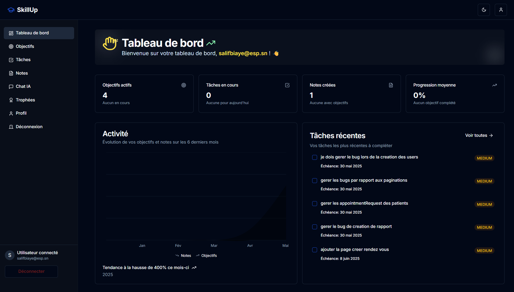
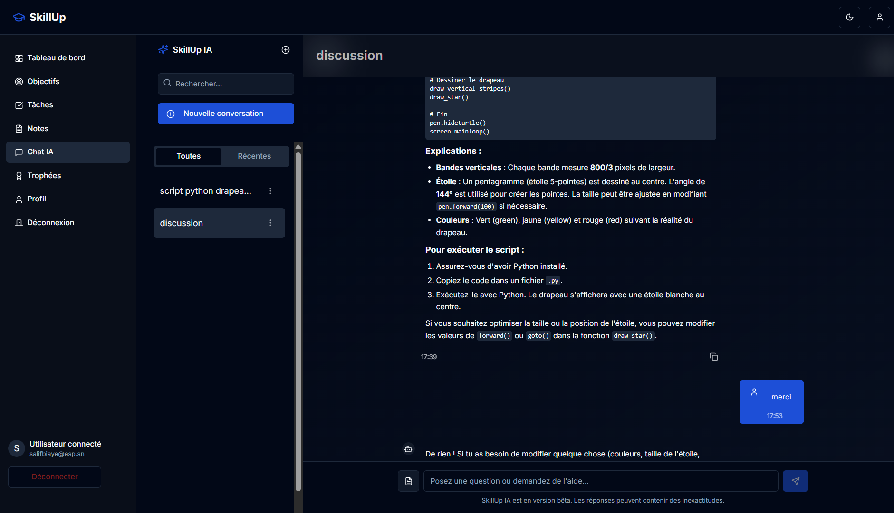

# SkillUp - Application de Développement Personnel

Application de gestion de notes, objectifs et développement personnel avec export PDF et intégration IA.

## Captures d'écran

### Page d'accueil


*Page d'accueil de l'application SkillUp*

### Tableau de bord


*Tableau de bord utilisateur avec suivi des objectifs et tâches*

### Chat IA


*Interface de chat IA pour l'assistance à l'apprentissage*

## Table des matières

- [Captures d'écran](#captures-décran)
- [Architecture](#architecture)
- [Fonctionnalités](#fonctionnalités)
- [Documentation API](#documentation-api)
- [Prérequis](#prérequis)
- [Déploiement avec Docker](#déploiement-avec-docker)
- [Variables d'environnement](#variables-denvironnement)
- [Dépannage](#dépannage)
- [Maintenance](#maintenance)
- [Fonctionnalités d'export PDF](#fonctionnalités-dexport-pdf)
- [Fonctionnalités de chat IA](#fonctionnalités-de-chat-ia)

## Architecture

L'application est composée de trois services principaux :

1. **Frontend** : Application Next.js avec interface utilisateur moderne
2. **Backend** : API REST Spring Boot pour la gestion des données
3. **Base de données** : MySQL pour le stockage persistant

## Fonctionnalités

- **Gestion de notes** avec support Markdown
- **Export PDF** avec différents thèmes
- **Gestion d'objectifs personnels** avec suivi de progression
- **Chat IA** pour l'assistance et l'apprentissage
- **Profil utilisateur** et suivi de progression

## Documentation API

Une documentation complète de l'API est disponible dans le fichier [docs/api-documentation.md](docs/api-documentation.md). Cette documentation détaille tous les endpoints disponibles, les méthodes HTTP supportées, les formats de requêtes et de réponses.

### Points clés de l'API

- **URL de base** : `http://backend:8080/api` ou la valeur de `NEXT_PUBLIC_API_URL`
- **Authentification** : JWT via l'en-tête `Authorization: Bearer {token}`
- **Endpoints principaux** :
  - `/auth/*` - Authentification et gestion des utilisateurs
  - `/notes/*` - Gestion des notes
  - `/goals/*` - Gestion des objectifs
  - `/tasks/*` - Gestion des tâches
  - `/chat-sessions/*` - Gestion des sessions de chat IA
  - `/profile/*` - Gestion du profil utilisateur

## Prérequis

- Docker et Docker Compose
- Git

## Déploiement avec Docker

### Configuration rapide avec Docker Compose

Le projet inclut un fichier `docker-compose.yml` qui permet de déployer l'ensemble de l'application (frontend, backend et base de données) en une seule commande :

```bash
# Cloner le dépôt (si ce n'est pas déjà fait)
git clone https://github.com/votre-organisation/skillup.git
cd skillup

# Démarrer tous les services
docker-compose up -d
```

L'application sera accessible à l'adresse : http://localhost:3000

> **Note** : Assurez-vous que tous les ports nécessaires (3000 pour le frontend, 8080 pour le backend) sont disponibles sur votre machine.

### Configuration manuelle des services

Si vous préférez configurer chaque service séparément, suivez ces étapes :

#### 1. Base de données PostgreSQL

```bash
docker run -d \
  --name skillup-db \
  -e POSTGRES_DB=skillup \
  -e POSTGRES_USER=postgres \
  -e POSTGRES_PASSWORD=postgres \
  -p 5432:5432 \
  -v postgres_data:/var/lib/postgresql/data \
  postgres:15-alpine
```

#### 2. Backend

```bash
# Assurez-vous d'avoir l'image du backend
docker run -d \
  --name skillup-backend \
  -e SPRING_DATASOURCE_URL=jdbc:postgresql://localhost:5432/skillup \
  -e SPRING_DATASOURCE_USERNAME=postgres \
  -e SPRING_DATASOURCE_PASSWORD=postgres \
  -e SPRING_JPA_HIBERNATE_DDL_AUTO=update \
  -p 8080:8080 \
  skillup-backend:latest
```

#### 3. Frontend

```bash
# Construire l'image du frontend
docker build -t skillup-frontend .

# Exécuter le conteneur frontend
docker run -d \
  --name skillup-frontend \
  -e NEXT_PUBLIC_API_URL=http://localhost:8080/api \
  -p 3000:3000 \
  skillup-frontend
```

### Variables d'environnement

#### Frontend (Next.js)

| Variable | Description | Valeur par défaut |
|----------|-------------|-------------------|
| `NEXT_PUBLIC_API_URL` | URL de l'API backend | `http://backend:8080/api` |
| `NODE_ENV` | Environnement d'exécution | `production` |
| `PORT` | Port d'écoute | `3000` |
| `HOSTNAME` | Nom d'hôte | `0.0.0.0` |

#### Backend

| Variable | Description | Valeur par défaut |
|----------|-------------|-------------------|
| `SPRING_DATASOURCE_URL` | URL de connexion à la base de données | `jdbc:mysql://db:3306/skillup` |
| `SPRING_DATASOURCE_USERNAME` | Nom d'utilisateur de la base de données | `root` |
| `SPRING_DATASOURCE_PASSWORD` | Mot de passe de la base de données | `root_password` |
| `SPRING_JPA_HIBERNATE_DDL_AUTO` | Mode de mise à jour du schéma de la base de données | `update` |
| `JWT_SECRET` | Clé secrète pour la génération des tokens JWT | *Valeur aléatoire* |
| `OPENROUTER_API_KEY` | Clé API pour OpenRouter (IA) | *À configurer* |

### Optimisations du Dockerfile

Le Dockerfile du frontend utilise une approche multi-étapes pour optimiser la taille de l'image finale :

1. **Étape de construction** : Installe les dépendances et compile l'application
2. **Étape de production** : Utilise uniquement les fichiers nécessaires pour l'exécution

Autres optimisations :
- Utilisation d'Alpine Linux pour réduire la taille de l'image
- Exécution en tant qu'utilisateur non-root pour améliorer la sécurité
- Désactivation de la télémétrie Next.js
- Mise en cache des dépendances npm

## Dépannage

### Problèmes de connexion au backend

Si le frontend ne parvient pas à se connecter au backend :

1. Vérifiez que le service backend est en cours d'exécution :
   ```bash
   docker ps | grep backend
   ```

2. Vérifiez les journaux du backend pour identifier les erreurs :
   ```bash
   docker logs skillup-backend
   ```

3. Assurez-vous que la variable d'environnement `NEXT_PUBLIC_API_URL` est correctement configurée dans le conteneur frontend :
   ```bash
   docker exec skillup-frontend env | grep NEXT_PUBLIC_API_URL
   ```

4. Vérifiez que le réseau Docker est correctement configuré pour permettre la communication entre les conteneurs :
   ```bash
   docker network inspect skillup_default
   ```

### Problèmes de base de données

1. Vérifiez que le conteneur MySQL est en cours d'exécution :
   ```bash
   docker ps | grep db
   ```

2. Vérifiez les journaux de la base de données :
   ```bash
   docker logs db
   ```

3. Connectez-vous à la base de données pour vérifier son état :
   ```bash
   docker exec -it db mysql -u root -p skillup
   ```
   (Utilisez le mot de passe défini dans les variables d'environnement)

## Maintenance

### Sauvegardes de la base de données

Pour créer une sauvegarde de la base de données MySQL :

```bash
docker exec -t db mysqldump -u root -p skillup > backup_$(date +%Y%m%d_%H%M%S).sql
```

Pour restaurer une sauvegarde :

```bash
cat backup_file.sql | docker exec -i db mysql -u root -p skillup
```

### Mise à jour des conteneurs

Pour mettre à jour les conteneurs avec les dernières versions :

```bash
# Arrêter les conteneurs
docker-compose down

# Reconstruire et redémarrer
docker-compose up -d --build
```

## Fonctionnalités d'export PDF

L'application inclut un service d'export PDF modulaire qui permet de convertir les notes en fichiers PDF avec différents thèmes. Cette fonctionnalité est entièrement intégrée dans le conteneur frontend et ne nécessite pas de configuration supplémentaire.

Les services modulaires d'export PDF comprennent :
- **PdfThemeService** : Gestion des thèmes et styles
- **PdfMarkdownService** : Traitement du formatage Markdown
- **PdfCodeBlockService** : Rendu des blocs de code
- **PdfUtilsService** : Utilitaires pour le traitement des emojis et la génération de noms de fichiers

## Fonctionnalités de chat IA

L'application intègre un système de chat IA avec les fonctionnalités suivantes :

- **Sessions de chat** : Création et gestion de conversations avec l'IA
- **Streaming de messages** : Effet de streaming pour la première réponse de l'IA dans une session
- **Intégration avec les notes** : Possibilité de référencer des notes dans les conversations
- **Types de messages** : Support pour différents types de messages (texte, note, liste de notes)

Les messages de chat sont structurés selon le modèle suivant :
- `id` : Identifiant unique du message
- `sessionId` : Identifiant de la session de chat
- `content` : Contenu textuel du message
- `role` : Rôle (user ou assistant)
- `timestamp` : Horodatage du message
- `type` : Type de message (text, note, note-list)
- `metadata` : Métadonnées (références aux notes)

## Conclusion

Cette configuration Docker permet de déployer rapidement l'application SkillUp avec tous ses composants. La documentation API complète est disponible dans le dossier `docs/`. Pour toute question ou problème, veuillez consulter la documentation ou ouvrir une issue sur le dépôt GitHub du projet.
