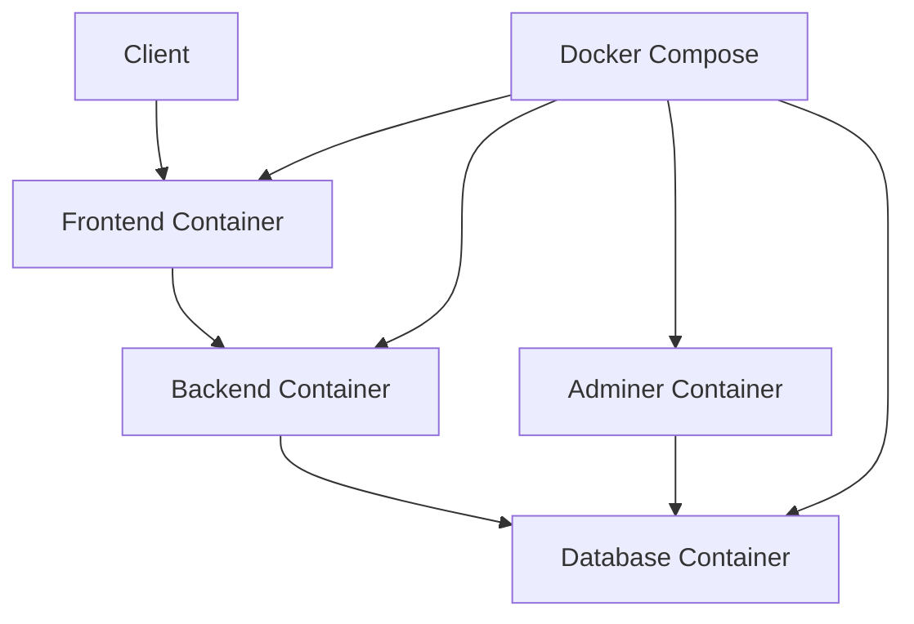
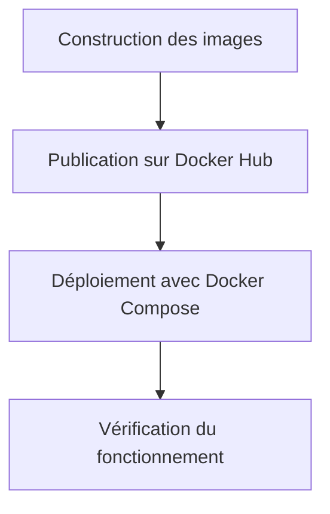

# Rapport DevOps - Projet SkillUp

## Réalisé par : Salif Biaye

## Introduction

Ce rapport présente les aspects DevOps du projet SkillUp, développé en une semaine. Il décrit la mise en place de l'infrastructure Docker pour le déploiement de l'application. En tant que responsable DevOps, j'ai mis en place une configuration Docker simple mais efficace pour faciliter le déploiement et les tests de l'application.

## Architecture de Déploiement

L'application SkillUp est déployée en utilisant Docker et Docker Compose pour orchestrer les différents services. Cette approche nous permet de :

- Isoler les différents composants de l'application
- Faciliter le développement et les tests
- Assurer un déploiement cohérent

## Conteneurisation

### Frontend (Next.js)

J'ai utilisé un Dockerfile multi-stage pour l'application Next.js 15 :

1. **Stage de dépendances** : Installation des dépendances npm
2. **Stage de build** : Compilation de l'application Next.js
3. **Stage de production** : Image légère pour le déploiement

Caractéristiques principales :
- Utilisation de Node.js Alpine comme image de base
- Configuration d'un utilisateur non-root
- Exposition du port 3000 pour le serveur Next.js

### Backend (Spring Boot)

Pour le backend Spring Boot, j'ai utilisé une image pré-construite :

- Image `gdxebec/skillup-backend:latest`
- Configuration des variables d'environnement via Docker Compose
- Exposition du port 8080 pour l'API REST

## Orchestration avec Docker Compose

Le fichier `docker-compose.yml` permet de déployer tous les services nécessaires :

1. **Backend** : Service Spring Boot exposé sur le port 8080
2. **Frontend** : Application Next.js exposée sur le port 3000
3. **Database** : Instance MySQL pour le stockage des données
4. **Adminer** : Interface d'administration de la base de données

Caractéristiques principales :
- Configuration des variables d'environnement pour chaque service
- Définition des dépendances entre services
- Mise en place d'un réseau dédié pour la communication
- Configuration d'un volume pour la persistance des données MySQL

## Configuration et Variables d'Environnement

J'ai configuré les services avec les variables d'environnement nécessaires :

- Paramètres de connexion à la base de données
- Configuration JWT pour l'authentification
- Paramètres de l'API OpenRouter pour l'assistant IA
- URL de l'API pour la communication frontend-backend

## Processus de Déploiement

Le processus de déploiement est simple et direct :

1. Construction des images Docker
2. Publication des images sur Docker Hub
3. Déploiement via Docker Compose

## Sécurité de Base

J'ai implémenté quelques mesures de sécurité de base :

- Utilisation d'un utilisateur non-root pour le frontend
- Isolation des services dans un réseau Docker dédié
- Configuration des variables d'environnement pour éviter les secrets en dur

## Défis Rencontrés et Solutions

### Défi 1 : Délai très court
Le principal défi était de mettre en place une infrastructure fonctionnelle en une semaine. J'ai opté pour une approche simple mais efficace avec Docker Compose, en utilisant des images pré-construites quand c'était possible.

### Défi 2 : Configuration de la base de données
J'ai dû configurer correctement les variables d'environnement pour la connexion à la base de données et assurer la persistance des données via un volume Docker.

### Défi 3 : Communication inter-services
J'ai configuré un réseau Docker dédié et défini les variables d'environnement appropriées pour permettre la communication entre le frontend et le backend.

## Améliorations Futures

Pour les prochaines étapes du projet, je prévois d'implémenter :

1. **Backup automatisé** : Système simple de sauvegarde de la base de données
2. **Environnements de développement et production** : Séparation des configurations
3. **Monitoring de base** : Surveillance des logs et de l'état des conteneurs

## Conclusion

Malgré le délai très court d'une semaine, j'ai réussi à mettre en place une infrastructure Docker fonctionnelle pour le projet SkillUp. L'utilisation de Docker et Docker Compose a permis de simplifier le déploiement et d'assurer une cohérence entre les environnements de développement.

La configuration actuelle est simple mais efficace, permettant à l'équipe de se concentrer sur le développement des fonctionnalités plutôt que sur les problèmes d'infrastructure. Les bases sont posées pour des améliorations futures qui rendront l'infrastructure plus robuste et plus évolutive.
