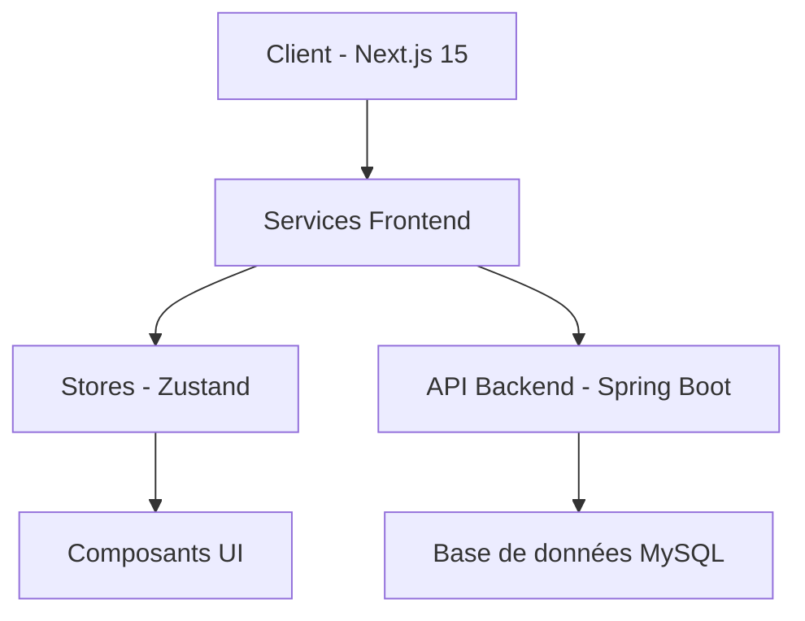
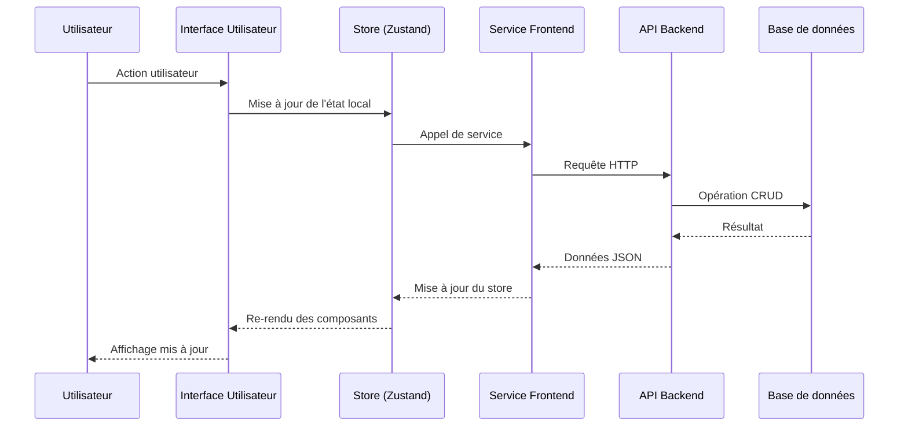
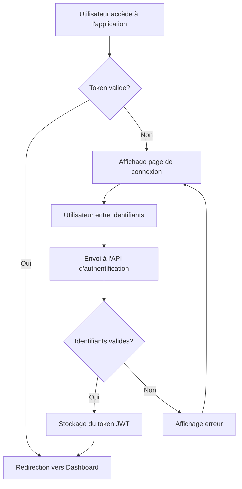
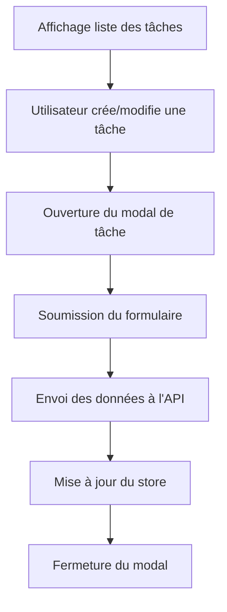
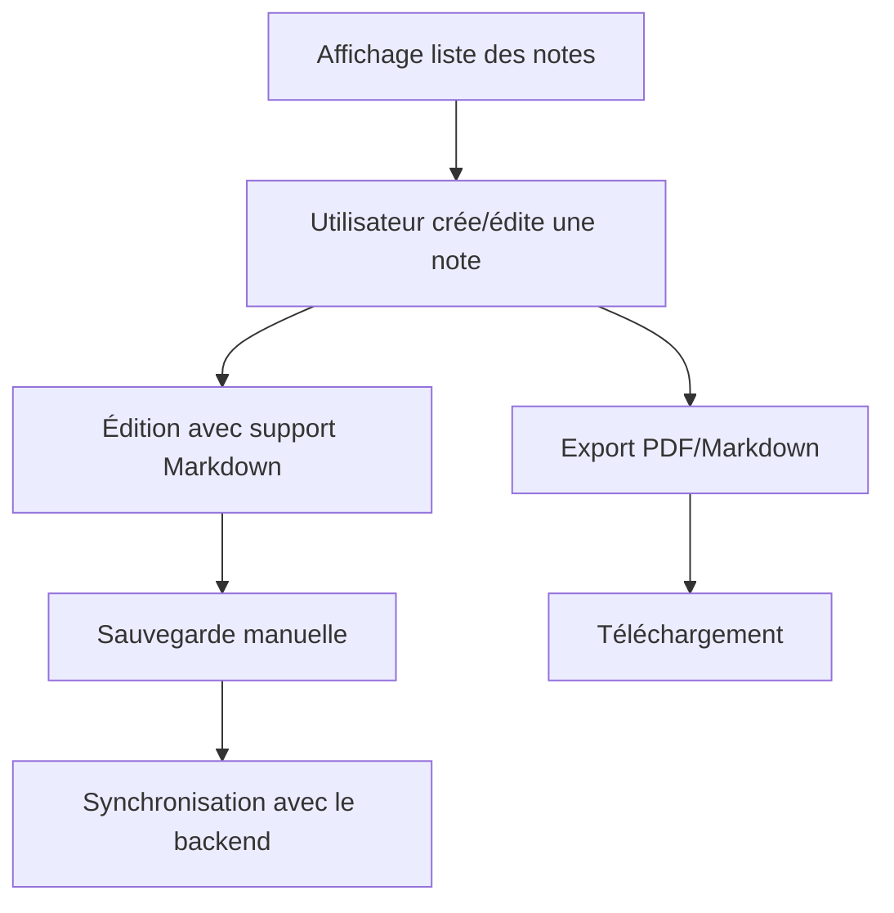
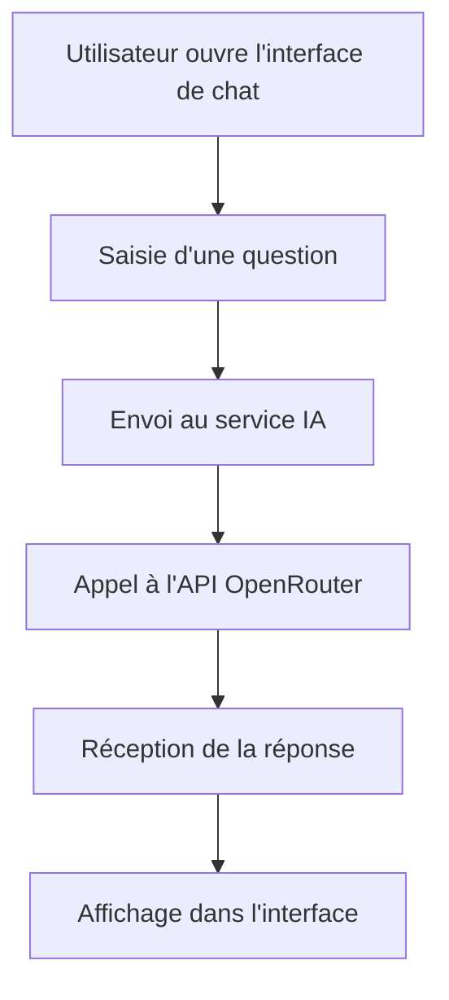

# Rapport sur le Workflow de l'Application SkillUp

## Introduction

Ce document présente le workflow et l'architecture de notre application SkillUp, développée en une semaine. Nous y décrivons les différentes couches de l'application, les interactions entre les composants, et le fonctionnement des principales fonctionnalités. Cette documentation servira de référence pour comprendre le fonctionnement actuel de l'application et guider les développements futurs.

## Architecture Globale

SkillUp utilise une architecture client-serveur simple mais efficace, avec une séparation entre le frontend et le backend. Voici les principales couches :

### Couches Frontend

1. **Composants UI** : Interface utilisateur construite avec React et Tailwind CSS
2. **Stores** : Gestion de l'état global avec Zustand
3. **Services** : Communication avec l'API backend
4. **Types** : Définitions TypeScript pour assurer la cohérence des données

### Couches Backend

1. **Contrôleurs** : Points d'entrée API REST
2. **Services** : Logique métier
3. **Repositories** : Accès aux données
4. **Entités** : Modèles de données

## Flux de Données

## Stores et Gestion d'État

Nous utilisons Zustand pour la gestion d'état global, avec un store dédié pour chaque fonctionnalité principale :

1. **useAuthStore** : Gestion de l'authentification et des sessions
2. **useTasksStore** : Gestion des tâches et de leur état
3. **useObjectivesStore** : Gestion des objectifs
4. **useNotesStore** : Gestion des notes et de leur contenu
5. **useAiChatStore** : Gestion des conversations avec l'assistant IA
6. **useProfileStore** : Gestion des informations de profil utilisateur

Chaque store contient :
- L'état (données)
- Les actions (méthodes pour modifier l'état)
- Les appels API nécessaires

## Services API

Les services frontend assurent la communication entre les stores et le backend :

1. **ApiService** : Service de base pour les requêtes HTTP authentifiées
2. **TasksService** : Opérations CRUD pour les tâches
3. **NotesService** : Gestion des notes et exports
4. **ObjectivesService** : Gestion des objectifs
5. **AiChatService** : Communication avec l'API IA
6. **ProfileService** : Gestion du profil utilisateur

## Workflow des Fonctionnalités Principales

### Authentification

1. Vérification du token JWT au chargement
2. Redirection vers la page de connexion si nécessaire
3. Authentification via l'API backend
4. Stockage du token JWT dans le store et les cookies

### Gestion des Tâches

1. Affichage des tâches depuis le store
2. Création/modification via modal dédié
3. Envoi des données au backend
4. Mise à jour du store avec les nouvelles données

### Système de Notes

1. Éditeur Markdown avec prévisualisation
2. Sauvegarde manuelle des modifications
3. Options d'export en PDF et Markdown

### Assistant IA

1. Interface de chat simple
2. Envoi des messages au backend
3. Traitement via l'API OpenRouter
4. Affichage des réponses

## Sécurité et Authentification

La sécurité est gérée via JWT (JSON Web Tokens) :

1. **Authentification** : Génération d'un token lors de la connexion
2. **Autorisation** : Vérification du token pour chaque requête API
3. **Déconnexion** : Suppression du token et des données sensibles

## Conclusion

L'architecture de SkillUp, bien que développée en une semaine seulement, offre une base solide et fonctionnelle. La structure modulaire avec des stores Zustand dédiés à chaque fonctionnalité permet une gestion claire de l'état de l'application.

Les workflows décrits dans ce document illustrent le fonctionnement actuel des principales fonctionnalités. Cette architecture simple mais efficace pourra être enrichie dans les futures versions de l'application, tout en conservant les principes de base qui ont permis un développement rapide.
